<div align="center">



</div>

<br>

<div align="center">


</div>

```
rajan@devbox:~$ whoami
```

```
rajan_vishwakarma
  role        : Full Stack MERN Developer
  location    : Pune, Maharashtra, IN
  uptime      : 3+ years in production systems
  status      : currently shipping @ Innovit Labs
```

<br>

```
rajan@devbox:~$ cat ./about.log
```

```python
class RajanVishwakarma:
    def __init__(self):
        self.role        = "Full Stack MERN Developer"
        self.based_in    = "Pune, Maharashtra, India"
        self.focus       = ["cloud-native apps", "scalable APIs", "modern frontend architecture"]
        self.certs       = ["AWS", "Azure", "Snowflake GenAI/LLM"]
        self.currently   = "building production systems at Innovit Labs"

    def philosophy(self) -> str:
        return "ship clean, scale calmly, debug fearlessly"

    def __repr__(self):
        return f"<Engineer: {self.role} | {self.based_in} | status=ACTIVE>"


>>> dev = RajanVishwakarma()
>>> print(dev)
<Engineer: Full Stack MERN Developer | Pune, Maharashtra, India | status=ACTIVE>
```

<div align="center">


</div>

```
rajan@devbox:~$ ls -la ./stack/frontend/
```

| permissions | size | module          | notes                         |
|:-----------:|:----:|:----------------|:-------------------------------|
| `-rwxr-xr-x` | 14K | `react.js`       | component architecture, hooks |
| `-rwxr-xr-x` | 12K | `next.js`        | SSR / SSG / app router         |
| `-rwxr-xr-x` | 9K  | `typescript`     | strict mode, default           |
| `-rwxr-xr-x` | 8K  | `javascript`     | ES2023+                        |
| `-rwxr-xr-x` | 6K  | `redux-toolkit`  | global state mgmt              |
| `-rwxr-xr-x` | 5K  | `tailwindcss`    | utility-first styling          |
| `-rwxr-xr-x` | 5K  | `material-ui`    | component libraries            |

```
rajan@devbox:~$ ls -la ./stack/backend/
```

| permissions | size | module          | notes                         |
|:-----------:|:----:|:----------------|:-------------------------------|
| `-rwxr-xr-x` | 13K | `node.js`        | runtime, async I/O             |
| `-rwxr-xr-x` | 11K | `express.js`     | REST API layer                 |
| `-rwxr-xr-x` | 10K | `nestjs`         | modular service architecture   |
| `-rwxr-xr-x` | 9K  | `graphql`        | schema-first APIs              |
| `-rwxr-xr-x` | 7K  | `rest-apis`      | versioned, documented          |

```
rajan@devbox:~$ ls -la ./stack/data+cloud/
```

| permissions | size | module          | notes                         |
|:-----------:|:----:|:----------------|:-------------------------------|
| `-rwxr-xr-x` | 12K | `mongodb`        | primary datastore              |
| `-rwxr-xr-x` | 8K  | `postgresql`     | relational workloads           |
| `-rwxr-xr-x` | 6K  | `redis`          | caching / sessions             |
| `-rwxr-xr-x` | 10K | `aws`            | deployment, infra              |
| `-rwxr-xr-x` | 9K  | `azure`          | deployment, infra              |
| `-rwxr-xr-x` | 8K  | `snowflake-genai`| LLM functions, data + AI       |

```
rajan@devbox:~$ ls -la ./stack/devops/
```

| permissions | size | module          | notes                         |
|:-----------:|:----:|:----------------|:-------------------------------|
| `-rwxr-xr-x` | 9K  | `docker`         | containerization               |
| `-rwxr-xr-x` | 11K | `kubernetes`     | orchestration                  |
| `-rwxr-xr-x` | 6K  | `github-actions` | CI/CD pipelines                |
| `-rwxr-xr-x` | 5K  | `nginx`          | reverse proxy, load balancing  |
| `-rwxr-xr-x` | 7K  | `linux`          | daily driver                   |

<div align="center">


</div>

```
rajan@devbox:~$ git log --oneline --graph --all
```

```
* 2025-06  HEAD -> main  Innovit Labs — MERN Stack Developer (current)
* 2023-06  tag: search-in  Full Stack Developer @ Search-In
* 2022-05  tag: freelance  Freelance MERN Consultant
```

```
rajan@devbox:~$ git show search-in --stat
```

```
commit  search-in
Author: Rajan Vishwakarma
Date:   June 2023 – May 2025

    Full Stack Developer @ Search-In

    - owned features end-to-end across MERN stack
    - shipped production APIs and React interfaces
    - collaborated cross-functionally on system design
```

```
rajan@devbox:~$ git show freelance --stat
```

```
commit  freelance
Author: Rajan Vishwakarma
Date:   May 2022 – May 2023

    Freelance MERN Consultant

    - delivered full-stack solutions for independent clients
    - handled requirements, architecture, and deployment solo
```

<div align="center">


</div>

```
rajan@devbox:~$ gpg --verify ./certifications/*.sig
```

```
gpg: Signature made for snowflake-genai-llm-functions.cert
gpg: Good signature from "Snowflake" [VALID]

gpg: Signature made for microsoft-azure-essentials.cert
gpg: Good signature from "Microsoft" [VALID]

gpg: Signature made for aws-essentials.cert
gpg: Good signature from "Amazon Web Services" [VALID]

gpg: Signature made for fullstack-java-development.cert
gpg: Good signature from "Issuing Authority" [VALID]

gpg: Signature made for devops-fundamentals.cert
gpg: Good signature from "Issuing Authority" [VALID]

------------------------------------------------------------
  5 signatures checked, 5 valid, 0 revoked, 0 expired
------------------------------------------------------------
```

<div align="center">


</div>

```
rajan@devbox:~$ find ./projects -maxdepth 1 -type d
```

```
./projects/copify
./projects/multi-vendor-ecommerce-platform
./projects/ai-integrated-crm-platform
./projects/realtime-analytics-dashboard
```

```
rajan@devbox:~$ cat ./projects/multi-vendor-ecommerce-platform/README
```

```
NAME      multi-vendor-ecommerce-platform
STACK     MERN
FEATURES  product management · order tracking
          payment integration · real-time notifications
          cloud deployment
STATUS    production-ready
```

```
rajan@devbox:~$ cat ./projects/ai-integrated-crm-platform/README
```

```
NAME      ai-integrated-crm-platform
STACK     MERN + microservices
FEATURES  multi-tenant architecture · RBAC
          AI-driven insights · workflow automation
STATUS    production-ready
```

```
rajan@devbox:~$ cat ./projects/realtime-analytics-dashboard/README
```

```
NAME      realtime-analytics-dashboard
STACK     MERN + event streaming
FEATURES  live metrics · event streaming
          data visualization · real-time reporting
STATUS    production-ready
```

<div align="center">


</div>

```
rajan@devbox:~$ ps aux | grep rajan
```

```
USER     PID  STAT  COMMAND
rajan    0001 R     shipping-features --target=production
rajan    0002 R     reviewing-pull-requests --strict
rajan    0003 S     learning --topic="cloud-native-architecture"
rajan    0004 R     debugging --until=root-cause-found
```

<div align="center">


</div>

```
rajan@devbox:~$ cat ./contact.cfg
```

<div align="center">

[](mailto:rajanv8698@gmail.com)
[](https://www.linkedin.com/in/rajan-vishwakarma-a86ba4215)
[](https://github.com/rajanv21)

```
process rajan exited normally (status=0)
session closed — connection will remain open for collaboration requests
```

</div>
